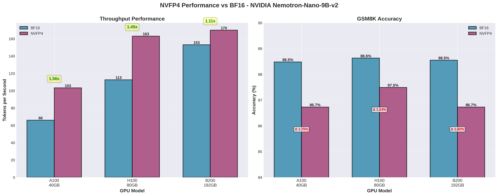
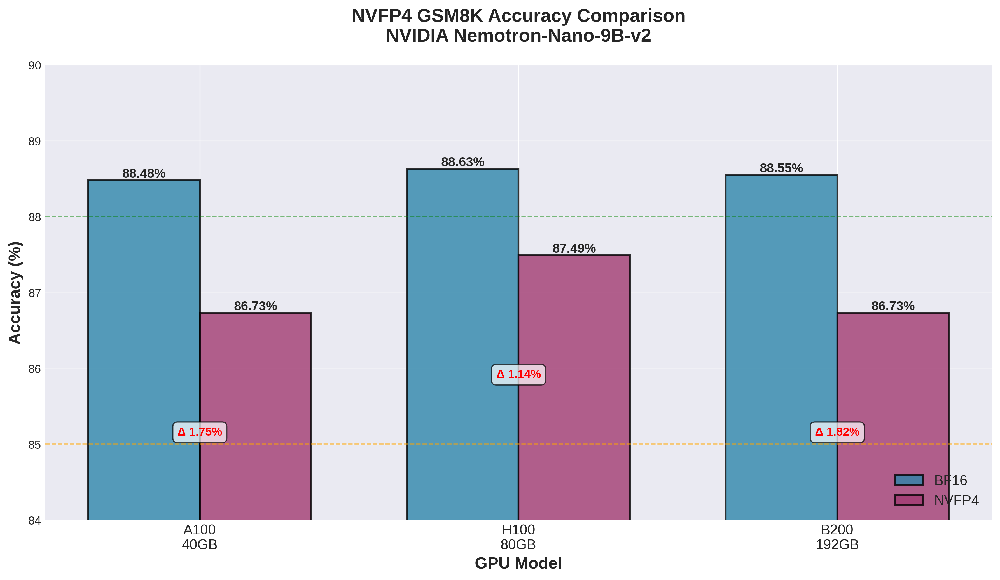
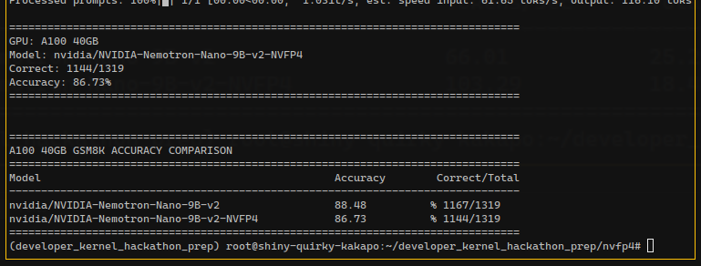
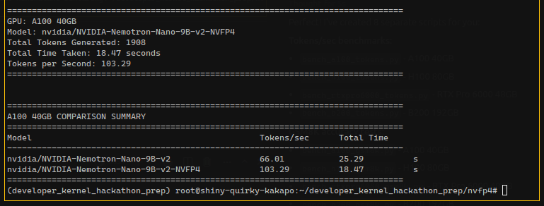
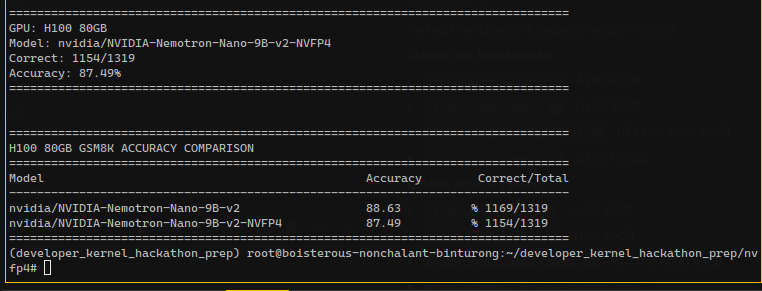
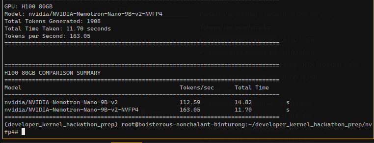
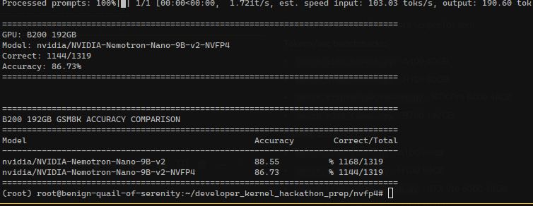
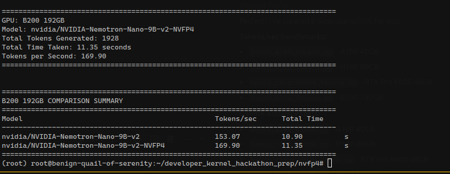

# NVFP4

Understanding and benchmarking the inference speed of NVIDIA's FP4 (NVFP4) data type on GPUs that support it, such as the H100. Basically i have my 4060 lap over here, let's test the inference speeds.

## Benchmark Results

Testing performed on NVIDIA Nemotron-Nano-9B-v2 model with NVFP4 quantization across different GPU architectures.

### Overall Comparison Across All GPUs

**Combined Performance Overview:**

**Throughput Comparison:**

**Accuracy Comparison:**

**Key Insights:**
- **A100** shows the highest speedup (1.56x) with NVFP4
- **B200** achieves the best absolute throughput (169.90 tokens/sec)
- **H100** provides excellent balance with 1.45x speedup and 163.05 tokens/sec
- **Accuracy degradation** is minimal across all GPUs (~1.14-1.82% drop)

---

### A100 40GB

**GSM8K Accuracy:**
- Standard: 88.48% (1167/1319)
- NVFP4: 86.73% (1144/1319)

**Throughput Performance:**
| Model | Tokens/sec | Total Time (s) | Speedup |
|-------|-----------|----------------|---------|
| Standard | 66.01 | 25.29 | - |
| NVFP4 | 103.29 | 18.47 | **1.56x** |

### H100 80GB

**GSM8K Accuracy:**
- Standard: 88.63% (1169/1319)
- NVFP4: 87.49% (1154/1319)

**Throughput Performance:**
| Model | Tokens/sec | Total Time (s) | Speedup |
|-------|-----------|----------------|---------|
| Standard | 112.59 | 14.82 | - |
| NVFP4 | 163.05 | 11.70 | **1.45x** |

### B200 192GB

**GSM8K Accuracy:**
- Standard: 88.55% (1168/1319)
- NVFP4: 86.73% (1144/1319)

**Throughput Performance:**
| Model | Tokens/sec | Total Time (s) | Speedup |
|-------|-----------|----------------|---------|
| Standard | 153.07 | 10.90 | - |
| NVFP4 | 169.90 | 11.35 | **1.11x** |

### Summary

- **Best Speedup**: A100 with 1.56x improvement
- **Best Absolute Performance**: B200 with 169.90 tokens/sec
- **Accuracy Trade-off**: Minimal accuracy loss (~1-2%) for significant speedup
- **Consistency**: NVFP4 maintains competitive accuracy across all tested GPUs

## Known Issues

### RTX Pro 6000 Ada - NVFP4 Incompatibility

**Primary Issue: CUTLASS FP4 Kernel Error**

The RTX Pro 6000 Ada encounters a critical `RuntimeError: Error Internal from torch.ops._C.cutlass_scaled_fp4_mm` when attempting to use NVFP4 quantization. This is a known issue with NVFP4 quantization support and specific GPU compute capabilities.

**Technical Details:**
- **GPU Architecture**: Ada Lovelace (compute capability 8.9, sm89)
- **Root Cause**: Limited FP4 kernel support in vLLM's CUTLASS implementation for sm89 architecture
- **Specific Failure Point**: Error occurs during `mamba_mixer2` operations in the profile run, indicating incompatibility between NVFP4 quantization and Mamba layer kernels on Ada architecture

**Root Causes:**
1. **NVFP4 Kernel Compatibility**: The CUTLASS FP4 kernels used by vLLM lack complete support for sm89 (Ada) architecture, particularly for hybrid Mamba-2 models like Nemotron Nano
2. **Mamba Mixer Operations**: Incompatibility between NVFP4 quantization and Mamba layer kernels on this GPU architecture

**Recommendation**: For Ada Lovelace architecture (RTX 40-series, RTX Pro 6000), use standard quantization methods (FP8, INT8) instead of NVFP4 until kernel support is improved.

